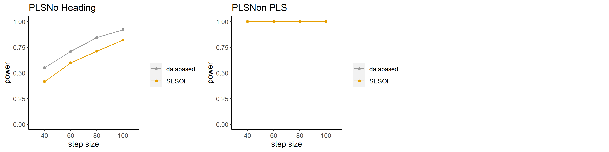
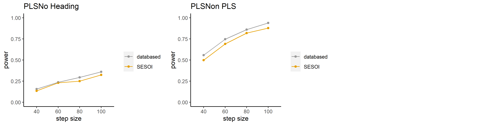

```{r setup, include=FALSE}
knitr::opts_chunk$set(echo = TRUE)

library(lme4)
library(lmerTest)
library(mixedpower)
```

## 說明

採用Kumle et al. (2021)開發的[`mixedpower`](https://github.com/DejanDraschkow/mixedpower)套件，並參考[範例](https://lkumle.github.io/power_notebooks/Scenario1_notebook.html)，使用Kerwer et al.(2020)提供的[源始分析腳本](20200921_Analysis.rmd)建立的混合效果模型，模擬不同樣本可達到的考驗力。


```{r read-data, echo=TRUE, results='show', message=TRUE, warning=TRUE, include=T}


df <- read.csv("Gesamtdatensatz_Total_Dataset_Matrix.csv", na.strings = c("-999"))
#df_codebook <- read.csv("Gesamtdatensatz_Total_Dataset_Codebook.csv")

df_wiss <- read.csv("Wissenstestdatensatz_Knowledge_Test_Dataset_Matrix.csv", na.strings = c("-999"))


```

## H1 Comprehensibility


```{r h01, echo=TRUE, message=FALSE, warning=FALSE}
df$PLS <- factor(df$PLS, levels = c("PLS", "No Heading", "Non PLS"))

df$NH <- factor(df$PLS == "No Heading")
df$OSA <- factor(df$PLS == "Non PLS")

h01m <- lmer(vst ~ (1 | study) + PLS + (1 | id), data = df)

summary(h01m)

## Prepare for simulation
fixed_effects <- c("PLS")
simvar <- "id"

## Simulation parameters
steps <- c(40, 60, 80, 100) # which sample sizes do we want to look at?
critical_value <- 2 # which t/z value do we want to use to test for significance?
n_sim <- 1000 # how many single simulations should be used to estimate power?
```

```{r h01_sim, eval=FALSE, message=FALSE, warning=FALSE, include=FALSE,echo=TRUE}
# set up SESOI model summary
SESOI <- c(6.30467,-0.3,-0.8)

# RUN SIMULATION
power_SESOI_h01m <- mixedpower(model = h01m, data = df,
                        fixed_effects = fixed_effects,
                        simvar = simvar, steps = steps,
                        critical_value = critical_value, n_sim = n_sim,
                        SESOI = SESOI, databased = T)
# PLOT RESULTS
multiplotPower(power_SESOI_h01m, filename = "h01_sim.png")
```

```{r echo=FALSE}

```


## H2 knowledge acquisition


```{r h02, echo=TRUE, message=FALSE, warning=FALSE}
df_wiss$PLS <- factor(df_wiss$PLS, levels = c("PLS", "No Heading", "Non PLS"))


h02m <- glmer(test ~ (1 | study) + PLS + (1 | id), family = binomial("logit"), data = df_wiss)
  

summary(h02m)
```


```{r h02_sim, eval=FALSE, message=FALSE, warning=FALSE, include=FALSE,echo=TRUE}
# set up SESOI by model summary
SESOI <- c(1.45918, -0.2,-0.4)

# RUN SIMULATION
power_SESOI_h02m <- mixedpower(model = h02m, data = df_wiss,
                        fixed_effects = fixed_effects,
                        simvar = simvar, steps = steps,
                        critical_value = critical_value, n_sim = n_sim,
                        SESOI = SESOI, databased = T)
# PLOT RESULTS
multiplotPower(power_SESOI_h02m, filename = "h02_sim.png")
```


```{r echo=FALSE}

```


## H3 Credibility


```{r h03, echo=TRUE, message=FALSE, warning=FALSE}

h03m <- lmer(vtr ~ (1 | study) +PLS + (1 | id), data = df)

summary(h03m)
```


```{r h03_sim, eval=FALSE, message=FALSE, warning=FALSE, include=FALSE,echo=TRUE}
# set up SESOI by model summary
SESOI <- c(5.36548, -0.12,-0.12)

# RUN SIMULATION
power_SESOI_h03m <- mixedpower(model = h03m, data = df,
                        fixed_effects = fixed_effects,
                        simvar = simvar, steps = steps,
                        critical_value = critical_value, n_sim = n_sim,
                        SESOI = SESOI, databased = T)
# PLOT RESULTS
multiplotPower(power_SESOI_h03m, filename = "h03_sim.png")
```


```{r echo=FALSE}
knitr::include_graphics("h03_sim.png")
```


## H4 Ability to Evaluate


```{r h04, echo=TRUE, message=FALSE, warning=FALSE}

h04m <- lmer(wahr ~ (1 | study) +PLS + (1 | id), data = df)

summary(h04m)
```


```{r h04_sim, eval=FALSE, message=FALSE, warning=FALSE, include=FALSE,echo=TRUE}
# set up SESOI by model summary
SESOI <- c(3.72630, -0.2,-0.23)

# RUN SIMULATION
power_SESOI_h04m <- mixedpower(model = h04m, data = df,
                        fixed_effects = fixed_effects,
                        simvar = simvar, steps = steps,
                        critical_value = critical_value, n_sim = n_sim,
                        SESOI = SESOI, databased = T)
# PLOT RESULTS
multiplotPower(power_SESOI_h04m, filename = "h04_sim.png")
```


```{r echo=FALSE}
knitr::include_graphics("h04_sim.png")
```


## H5 Ability to Make a Decision


```{r h05, echo=TRUE, message=FALSE, warning=FALSE}

h05m <- lmer(ent ~ (1 | study) +PLS + (1 | id), data = df)

summary(h05m)
```


```{r h05_sim, eval=FALSE, message=FALSE, warning=FALSE, include=FALSE,echo=TRUE}
# set up SESOI by model summary
SESOI <- c(3.11747, -0.3,-0.33)

# RUN SIMULATION
power_SESOI_h05m <- mixedpower(model = h05m, data = df,
                        fixed_effects = fixed_effects,
                        simvar = simvar, steps = steps,
                        critical_value = critical_value, n_sim = n_sim,
                        SESOI = SESOI, databased = T)
# PLOT RESULTS
multiplotPower(power_SESOI_h05m, filename = "h05_sim.png")
```


```{r echo=FALSE}
knitr::include_graphics("h05_sim.png")
```


### 參考文獻

Kumle, L., Võ, M. L.-H., & Draschkow, D. (2021). Estimating power in (generalized) linear mixed models: An open introduction and tutorial in R. Behavior Research Methods. https://doi.org/10.3758/s13428-021-01546-0
